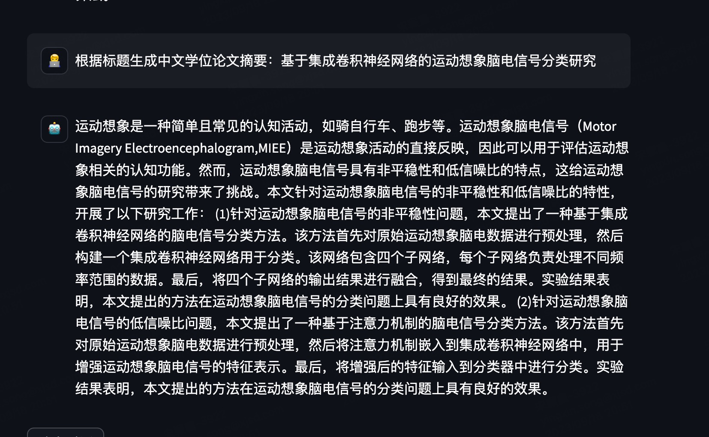
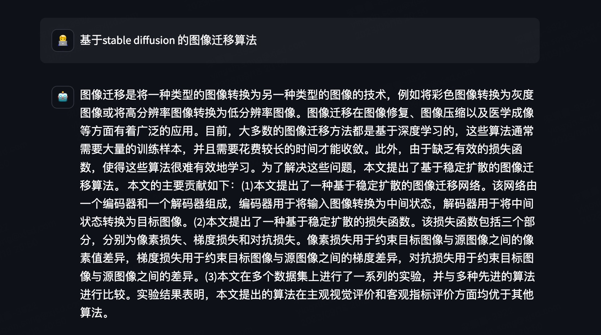

## 目录
- [项目简介](#项目简介)
- [整体架构](#整体架构)
- [模型评估](#模型评估)
- [模型预训练](#模型预训练)
- [模型微调](#模型微调)

## 项目简介
Baichuan-Novel 是一个开源的网文大语言模型，本项目的目的是基于现有的开源大模型 Baichuan1 与 Baichuan2 来进行领域预训练，后续如果有更好的基座会进行切换。

本项目依托于网文数据，主要进行以下几个方面的工作：
- 基于论文摘要数据的微调，原因在于小说任务难以评测，用论文摘要任务来验证代码以及baichuan的能力
- 基于网文数据进行领域 Pretain
- 支持主流的开源大模型，如 [baichuan1](https://github.com/baichuan-inc/Baichuan-7B), [baichuan2](https://github.com/baichuan-inc/Baichuan2)
- 模型架构优化：采用向量融入的方式，针对小说场景下的生成问题进行模型结构优化，致力于解决小说超长文本问题。
- 开源小说预训练数据集，论文摘要数据集

## 整体架构
我将我在做小说训练过程中用到的代码全都开放出来了，主要包括以下几个部分：
- Baichuan-Pretrain: 预训练的详细代码
- Baichuan-Finetune： 全参数微调的详细代码
- Baichuan-Finetune-Lora：基于 lora 进行微调的详细代码
- Baichuan-Finetune-QLora：基于 qlora 进行微调的详细代码
- Baichuan-Embedding：获得文本的向量并存储到本地
- Baichuan-Anysis：对模型，数据的分析代码，比如文本长度等
- web_demo.py： 运行 web 界面进行交互，非多轮

## 模型评估

```
pip install -r requirements.txt
```

基于网文发布的版本的下载链接如下表：

|  模型       |  下载地址 |
|:-------:|:-------:|
| Baichuan-Novel-base  | |
| Baichuan-Novel-chat  | |

Baichuan-Novel 的评估主要分为两种： 
- 第一种是直接用两本没参与训练的书来计算 Rouge 分
- 第二种是采用人工评估的方式来从多个角度进行评估（待完善）。

人工评估的方式需要从三个角度评估：
- **逻辑性：** 生成的内容是否与前文的逻辑连贯，没有出现逻辑错误。比如：上文还在打架，下文却开始喝酒。
- **背景知识：** 生成的内容不能与之前的章节的背景知识产生冲突，比如：萧炎和萱儿是青梅竹马，却当做是兄妹。
- **文风：** 生成的内容是否符合原文的整体文风，如有些小说喜欢卖弄文采，有些是纯小白文

对比各个模型的评估结果如下：

## 小说预训练

从各方数据源中汇集了一大批小说，由于计算资源限制，从中挑选了 500+ 本小说进行预训练。
之所以进行预训练，是因为网文的表达方式与原Baichuan中的数据差别非常大，因此有必要让它学会网文的表达方式。
- 数据的具体样例如下参见: Baichuan-Pretrain/data_examples/dev.json
- 数据清洗：数据本身比较干净，因此只采用了关键词来进行清洗
- 数据划分：将《异世邪君》作为评估集，其余书籍作为训练集，训练集 
- 代码运行：./ds_finetune.sh，你可以自行更改 ds_finetune.sh 中的参数
- 代码预训练方式：沿袭baichuan的预训练方式，没有精调超参数

实验中发现，对于小说而言，其预训练任务已经包含了微调任务，预训练任务更加重要。而如果构建指令微调任务，无非是基于预训练数据集在进行微调，意义不大。
因此，本文舍弃掉小说微调任务，只进行预训练。

## 论文微调

本来想在train和evel中直接引入 rouge 计算，但是引入 compute_metrics 后显存占用飙升，因为 compute_metrics 中会输出 predictions 和 labels，其中 predictions 的维度为 [bs, seq_len, vocab_size]，非常非常大。
因此，此处只采用 loss 计算。

微调数据采用论文实验，小说的微调意义不大，因为预训练中已经包含了微调的数据：
- 论文：论文标题生成摘要指令数据集，推荐先试用论文摘要数据集进行训练，然后对小说感兴趣再研究小说任务。

### 1. 论文微调指标一览

```
# 查看日志
tensorboard --logdir=log_finetune --port 8041 --host 10.20.31.13
每个文件夹下的 run_predict.sh，来获得 rouge 分
```

论文微调结果如下，评估标准按照 rouge F1 均值来评估：

|  微调方式    | loss | rouge-1 | rouge-2 | rouge-l
| --- | --- | --- | --- | --- |
| baichuan1 全参量微调 | 2.29 | 33.31% | 9.57% | 21.18% |
| baichuan1 lora 微调 | 2.27 | 33.75% |8.72% | 19.84% |
| baichuan1 qlora 微调 |  | | | |
| baichuan2 全参量微调 | 5.80 | 34.81% | 9.54% | 20.58% |
| baichuan2 lora 微调 | 2.62 | 33.18% | 9.5% | 20.79%|
| baichuan2 qlora 微调 |  | | | |

整体效果来看，有以下结论：
- baichuan1 和 baichuan2 微调后的效果差不多，需要注意的是，baichuan2 的损失一直在往上走，可能是baichuan 2 训练比较充分，后面会多进行几次实验。
- lora 微调和全参数微调效果差不多，可以用lora快速验证效果，但是推理速度，lora较慢，效果验证后依旧推荐全参数微调。

### 2. 效果一览




